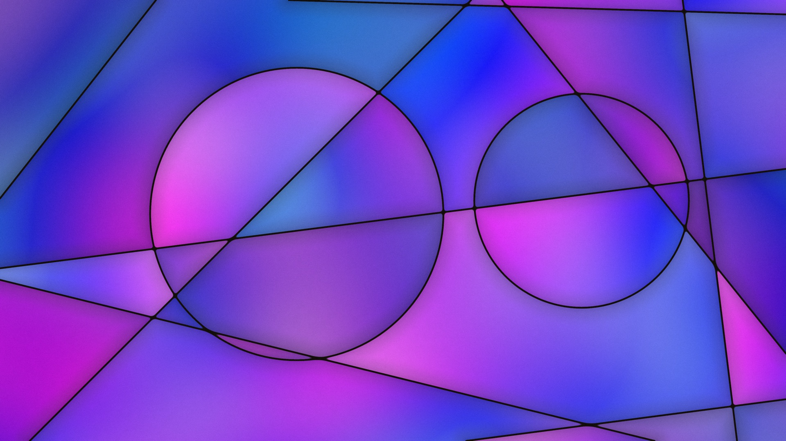

# Cue

Generative art that transforms text into stained glass visuals through sentiment analysis.



## How It Works

Cue analyzes text prompts using Claude to extract three emotional dimensions:

- **Valence** — emotional tone (dark/melancholic → bright/joyful)
- **Arousal** — energy level (calm/minimal → intense/dynamic)
- **Focus** — clarity (dreamy/diffuse → sharp/precise)

These dimensions influence every aspect of the generated artwork: color palette, shape density, glow intensity, noise texture, and watercolor bleeding effects. The result is rendered through WebGL shaders that simulate stained glass with leading lines, center glow, and organic texture.

## Features

- Text-to-art generation via Claude sentiment analysis
- Stained glass aesthetic with procedural noise and watercolor effects
- Tiled rendering for high-resolution exports (up to 8K)
- REST API for programmatic generation
- Docker support with SwiftShader for headless GPU rendering

## Running Locally

```bash
bun install
bun dev
```

Open http://localhost:3000

## API

Generate images programmatically:

```
GET /api/generate?width=1920&height=1080&valence=0.7&arousal=0.5&focus=0.6
```

Returns a PNG image. All parameters are optional with sensible defaults.

## Docker

```bash
docker build -t cue .
docker run -p 3000:3000 cue
```

## Stack

p5.js, WebGL 2, GLSL shaders, Bun, Puppeteer